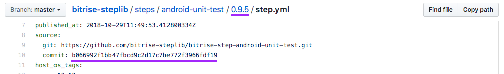

<h1 align="center"></img> StepLib</h1>

<h4 align="center">Bitrise StepLib is our versioned collection of our Steps.<br>This is the repository that all of our Steps that is visible in our <a href="https://www.bitrise.io/features/workflow-editor">Workflow Editor</a> and can be used in <a href="https://github.com/bitrise-io/bitrise">Bitrise CLI.</a></h4>

<p align="center">
Some of our sub-sites if you are new to Bitrise and want read more about Steps and our products:
<br>
  <a href="https://devcenter.bitrise.io">devcenter.bitrise.io</a> •
  <a href="https://discuss.bitrise.io">discuss.bitrise.io</a> •
  <a href="https://blog.bitrise.io">blog.bitrise.io</a>
</p>


# Feedback

Feel free to send us feedback on [Twitter](https://twitter.com/bitrise) or [file an issue](https://github.com/bitrise-io/bitrise/issues/new). Feature requests, pull requests are always welcome. If you wish to contribute, please take a quick look at the [Contribution](#contribution) section. If there's anything you'd like to chat about, please feel free to join our public [Slack](https://chat.bitrise.io/) workspace, or [Discuss](https://discuss.bitrise.io/) site.

# How to share a new Step or a new version of a Step

#### If you use the `bitrise.yml` included in this repository, all you have to do is:

1. In your Terminal / Command Line `cd` into this directory (where the `bitrise.yml` of the step is located)
1. Run: `bitrise run test` to test the step
1. Run: `bitrise run audit-this-step` to audit the `step.yml`
1. Check the `share-this-step` workflow in the `bitrise.yml`, and fill out the
   `envs` if you haven't done so already (don't forget to bump the version number if this is an update
   of your step!)
1. Then run: `bitrise run share-this-step` to share the step (version) you specified in the `envs`
1. Send the Pull Request, as described in the logs of `bitrise run share-this-step`

#### Sharing manually:

1. Start the share process with your StepLib fork URL.
    ```sh
    bitrise share start -c "${MY_STEPLIB_REPO_FORK_GIT_URL}"
    ```
1. Create the new realease.
    ```sh
    bitrise share create --stepid "${BITRISE_STEP_ID}" --tag "${BITRISE_STEP_VERSION}" --git "${BITRISE_STEP_GIT_CLONE_URL}"
    ```
1. Finish the process.
    ```sh
    bitrise share finish
    ```
1. Send in a PR with the changes in your fork.

# Structure

When you have a Step repository you can share that to our StepLib so it will become visible in our Workflow Editor and in the `bitrise.yml`. When you share your step we store a copy of your `step.yml` with a very little change because we need to store where your currently shared step version source is available.

#### `step.yml`s
```txt
/steps/<step-id>/<step-version>/step.yml
```
> `<step-id>` is to be able to identfy a step for example in `bitrise.yml`. For example: `- step-id@version: {}`

#### Step icon
```txt
/steps/<step-id>/assets/icon.svg
```

#### Deprecation note
```txt
/steps/<step-id>/step-info.yml
```
> With an example content:
>```yaml
>removal_date: "2018-09-20"
>deprecate_notes: |
>  This step is deprecated, some 3rd party service is now abandoned. Please use "another" step instead.
>```

# Requirements

- The tag created for a step version in your repository cannot be re-used/moved to another commit hash.
    > This is because we use the tag as the version and the commit hash also stored to the version so this way we can make sure that a source is surely matching the version.
    
- You need to read our [Step Development Guideline](https://github.com/bitrise-io/bitrise/blob/master/_docs/step-development-guideline.md).
- In the source reporitory must have a test which can be run with `bitrise run test` so we can test your Step under the PR review.
- Our Step auditor must pass. To check it yourself run our stepman tool in in your repository.
    > stepman audit --step-yml ./step.yml
    
    _Visit our [stepman](https://github.com/bitrise-io/stepman) tool's site to read more._
- You need to read and accept the [Abandoned Step policy](#abandoned-step-policy)

# Abandoned Step policy

We try to keep this Step Library up-to-date and active. Steps shared in this collection have to be actively maintained to receive fixes / updates when required (e.g. security issue fixes or general usability fixes).

**If you're a Step maintainer** you're not required to accept every Pull Request sent to your Step **but you should be reachable within a reasonable timeframe**. If we try to contact you several times regarding an important fix/update in your Step and you refuse to answer for several weeks *we might deprecate, remove or replace your Step* in the collection. Abandoned Steps can be a threat for those who use it, please keep this in mind if you decide to share your Step with others!

**If you shared a Step but you're no longer able to or you don't want to maintain it** please create a GitHub issue in this repository (https://github.com/bitrise-io/bitrise-steplib).

**If you're a user of a Step which has critical (security or functionality) issues** please create a ticket in the Step's Issue Tracker (every Step declares the preferred way of reporting issues with the `support_url` attribute - [see](https://github.com/bitrise-io/bitrise-steplib/blob/master/steps/activate-ssh-key/3.1.0/step.yml#L15)) first. If you don't get a response from the Step's maintainer for an extended period (reasonably, in general, for more than a couple of weeks) please create a GitHub issue in this repository (https://github.com/bitrise-io/bitrise-steplib) and we'll try to resolve the issue, following the Abandoned Step policy. *Please be patient* and keep in mind that everyone who contribute to this collection does that with an intention to help You by providing a Step for you to use, don't be rude to Step maintainers!